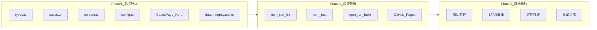

# sunny-portfolio 叙事升级 + 连锁/SaaS 跳槽完整计划

> **文档性质**：执行计划（待实施）。不修改源码时仅作交接与求职参考。  
> **概述**：在现有 sunny-portfolio 基础上做「单店 → 连锁/SaaS 可规模化」叙事升级（数据、文案、UI 小改），同步输出 4 周跳槽执行节奏；不新建站点、不引入路由或新依赖。

---

## 背景与目标

**现状：** sunny-portfolio 已是完整的「AI 实施顾问」求职作品集（Claude 写规格、Agent 执行），含 5 页、2 案例、Agent/工具/方法论，部署在 GitHub Pages（push main 自动 lint + test + build）。

**缺口：** 案例与方法论叙事停在「单店落地」，连锁/SaaS 落地公司会质疑「能否 rollout、能否产品化」。

**目标：** 用最小改动（约 6–8 个文件）把作品集讲成：**「单店是验证场，交付物是可复制模板，下一步服务多门店/SaaS 场景」**；并配套 4 周跳槽动作。



---

## Phase 1：站点内容升级（核心，约 1–2 天）

### 1.1 扩展数据模型

**文件：** `src/types.ts`

在 `Case.review` 中新增字段：

```typescript
review: {
  lessons: string[]
  reusable: string[]
  scaleOut: string[]   // 新增：复制到多门店/SaaS 的路径
}
```

不新增页面、不改 `PageId`、不引入 React Router（符合原规格「≈14 文件、不过度拆分」）。

---

### 1.2 案例数据：每案 3 条「规模化复制」叙事

**文件：** `src/cases.ts`

**原则：** 简历数字不变（《作品集开发规格说明书》§2 红线）；`background.scale` 保留「单店」事实，在 `scaleOut` 里写**假设性 rollout**（用「若复制到 10 家连锁门店」表述，避免虚构已服务连锁客户）。

| 案例 | scaleOut 要点（草稿方向） |
|------|---------------------------|
| 汽车饰品店 | 总部统一 Prompt/知识库；Coze 智能体模板按店复制；看板从单店 KPI 升级为「门店排行 + 总部汇总」；投流素材批量下发 |
| 中医诊所 | 图文/视频 Agent 工作流参数化（店名/科室/活动 3 变量）；SOP + 培训视频批量 onboarding；总部内容日历统一下发 |

同步微调 `summary` 一句：末尾加「方案已抽象为可配置模板」类表述（不夸大已落地连锁）。

---

### 1.3 方法论：五步法 → 六步法

**文件：** `src/content.ts`

新增 **STEP 6 · 规模化复制**：

- **定义：** 把单店验证过的方案抽象为可配置模块，设计 rollout SOP，支撑多门店/SaaS 批量交付。
- **要点（3 条）：** 模块参数化（总部 80% + 门店 20%）；试点→3 店验证→全量推广；总部仪表盘 + 门店对比报表。
- **关联案例：** `car-shop`（工具链模板化）+ 可在文案中交叉引用 `tcm-clinic`。

**联动修改：**

| 文件 | 改动 |
|------|------|
| `src/config.ts` | `entryCards` 方法论 desc 改为「六步法：从业务诊断到规模化复制」；`description` / `tagline` / `marqueeItems` / `terminalLines` / `seoDescription` 加入「可复制模板 / 多门店场景」；`tags` 增加「规模化交付」「Rollout SOP」 |
| `src/components/MethodologyPage.tsx` | 副标题「从诊断到复盘」→「从诊断到规模化复制」；文件头注释「五步法」→「六步法」 |
| `src/components/CasesPage.tsx` | 列表页 intro 文案：强调「单店验证 + 可复制模块 + 规模化路径」 |

---

### 1.4 案例详情 UI：新增「规模化路径」区块

**文件：** `src/components/CasesPage.tsx`

在现有「复盘与可复制性」两栏下方，增加第三块（全宽）：

```
SectionTitle: 规模化复制路径
ul: data.review.scaleOut
```

样式复用现有 amber 玻璃卡片，不新增组件文件。

---

### 1.5 首页求职意向卡微调

**文件：** `src/components/Hero.tsx`（约 L188–200）

当前硬编码：`AI 实施顾问 · 北京 · 11k–12k · 一周内到岗`

建议改为（**提交前需确认薪资/城市**）：

> AI 实施顾问 · 连锁/SaaS AI 落地 · 北京 · 11k–12k · 一周内到岗

若希望更灵活，可将求职意向抽到 `config.ts` 新字段 `jobIntent: string[]`，避免 Hero 硬编码——改动仍控制在 2 文件内。

---

### 1.6 测试与规格文档

| 文件 | 改动 |
|------|------|
| `src/data-integrity.test.ts` | `methodology` 长度断言 `5` → `6`；cases 断言 `review.scaleOut.length >= 3` |
| `作品集开发规格说明书.md` | 追加 §「v2 连锁叙事升级」变更记录（可选，便于后续维护） |

**不改动：** `src/App.tsx` 路由逻辑、AgentsPage、ToolsPage、Background、hooks。

---

## Phase 2：三绿门禁 + 部署（约 30 分钟）

在项目根目录执行：

```bash
npm run lint
npm test          # vitest run
npm run build
npm run dev       # 本地目视：首页 / 案例详情 / 方法论 6 步
```

通过后 push 至 `main`，`.github/workflows/deploy.yml` 会自动 lint → test → build → GitHub Pages。

**验收清单：**

- [ ] 两个案例详情均显示「规模化复制路径」3 条+
- [ ] 方法论时间轴 6 步，STEP 6 文案正确
- [ ] 首页 description / 终端动画 / SEO meta 与新区位一致
- [ ] 所有简历数字未被修改（12 万、+150%、60+ 客资等）
- [ ] CI 全绿

---

## Phase 3：跳槽执行计划（4 周，与 Phase 1–2 并行）

### 3.1 定位一句话（简历 + 开场白）

> 2 年 AI 实施落地经验，完成 2 家单店从 0 到 1 全链路改造（营收最高 +150%）；方案已抽象为 Agent + 工具模板，目标进入连锁/SaaS AI 落地团队，负责规模化交付与客户成功。

作品集链接置顶：`https://sun-rise-dev.github.io/sunny-portfolio/`

---

### 3.2 简历与作品集对齐

| 简历模块 | 对齐站点页面 | 动作 |
|----------|-------------|------|
| 项目经历 ×2 | Cases 详情 | 数字与 `src/cases.ts` 完全一致；每条末尾加 1 句「可规模化：…」 |
| 方法论 | Methodology STEP 1–6 | 简历用 3 行概括六步法，详情放链接 |
| 技术能力 | Agents + Tools | 列 Coze / Cursor / Claude Code + 3 个自研 PWA |
| 附件 | `孙炜烁的简历.pdf` | 内容更新后重新导出 PDF 替换（需本地生成） |

---

### 3.3 必准备的 3 个 STAR 故事（面试用）

每个故事结构：**情境 → 动作 → 结果 → 若复制到 50 店我会怎么改**

1. **选型故事**（汽车饰品店）：为什么自研工具 + Coze，而不是买一个 SaaS；如何嵌入投流/私信工作流。
2. **阻力故事**（中医诊所）：团队从 6→3 人，如何培训、SOP、让非技术同事用起来。
3. **效果故事**（两案综合）：用站点 Counter 数字；强调「可观测指标 + 复盘看板」如何驱动迭代。

每个故事 2 分钟版 + 30 秒版；面试时引导面试官打开 Cases 页对照。

---

### 3.4 目标公司与岗位类型

**优先投递（匹配度高）：**

- 垂直 SaaS + AI 模块（餐饮/零售/美业/教培/医疗）
- AI 落地服务商（帮连锁做私有化/混合部署）
- SaaS 厂商客户成功 / 解决方案 / AI 交付（有赞、微盟、客如云类）

**岗位关键词：** AI 实施顾问、解决方案工程师、客户成功（AI 方向）、AI 交付、Prompt 工程师（偏 B 端）

**暂缓：** 纯算法岗、纯销售岗（除非带交付团队）

---

### 3.5 4 周节奏

| 周 | 站点 | 求职 |
|----|------|------|
| **W1** | 完成 Phase 1 代码 + 本地验收 | 更新简历；整理 3 个 STAR；列 30 家目标公司 |
| **W2** | push 部署；发链接给 2–3 朋友做可读性反馈 | 投递 10 家；Boss/猎聘关键词监控 |
| **W3** | 根据反馈微调文案（仅 config/cases/content） | 投递 10 家；准备「规模化复制」深挖问答 |
| **W4** | 稳定版冻结 | 面试复盘；每面后更新 FAQ 文档 |

**每周投递量：** 10–15 家，质量优先；内推 > 猎头 > 海投。

---

### 3.6 面试高频题与站点映射

| 问题 | 用哪打开 |
|------|----------|
| 你做过连锁吗？ | Cases → scaleOut：「单店是 pilot，这是 rollout 设计」 |
| 怎么衡量 ROI？ | Cases → metrics + 方法论 STEP 5 |
| 和 SaaS 产品怎么配合？ | Methodology STEP 6 + Agents 模板化 |
| 你会写代码吗？ | Tools 页 3 个 PWA + GitHub |
| 为什么离开现客户？ | 口述：寻求规模化平台，把单店经验放大 |

---

## 范围外（本计划不做）

- 新建「连锁 AI 中台」Demo（可作为未来 Phase 2 独立项）
- 修改工作区其他项目（如 SayHi-Eeay）
- 变更简历 PDF 内的真实公司与数字（需本人审校）
- 未经明确要求时的 git commit / push

---

## 风险与约束

| 风险 | 应对 |
|------|------|
| 虚构连锁客户 | 只用「若复制到…」假设表述，不写「已服务 XX 连锁」 |
| 数字不一致 | 改文案后跑 `src/data-integrity.test.ts`；人工对照规格 §2 |
| Hero 硬编码求职意向 | 抽到 config 或确认后再改 |
| README 仍写「AI 内容运营模板」 | 可选同步 `README.md` 首段为顾问作品集说明 |

---

## 交付物（实施完成后）

1. 升级后的 sunny-portfolio 源码（6–8 文件 diff）
2. 通过 lint / test / build 的本地验证
3. GitHub Pages 线上版（push 后）
4. 可直接使用的：定位一句话、3 个 STAR 框架、4 周投递节奏、面试页面对照表

---

## 实施待办清单

| 序号 | 任务 | 文件/动作 |
|------|------|-----------|
| 1 | 扩展类型 | `src/types.ts`：`review.scaleOut` |
| 2 | 案例数据 | `src/cases.ts`：两案各 3+ 条 scaleOut |
| 3 | 方法论第六步 | `src/content.ts` + `src/config.ts` |
| 4 | UI 展示 | `CasesPage.tsx`、`MethodologyPage.tsx` |
| 5 | 求职意向 | `Hero.tsx` 或 `config.ts` |
| 6 | 测试 | `src/data-integrity.test.ts` + lint/test/build |
| 7 | 部署 | push main → GitHub Pages |
| 8 | 求职 | 简历、STAR、4 周投递节奏 |
